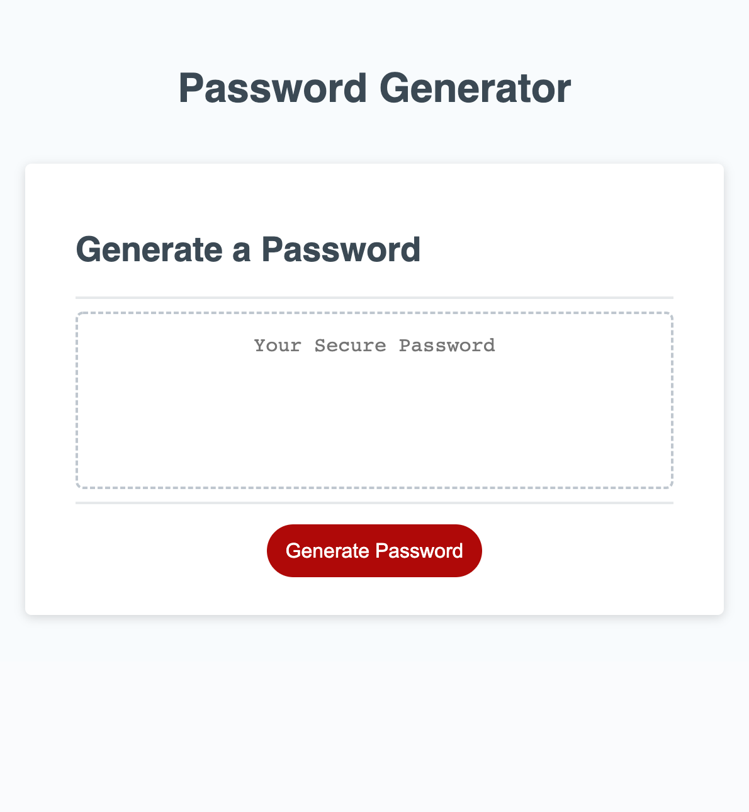

# Password Generator Challenge

By Dana Golebiewski

## Description 
For this challenge, I created a password generator from the start code that was provided. The user is able to pick a password containing 8-128 characters, upper or lower case characters, numbers, and special characters. 

The skills used in this challenge are arrays, functions, if/else statements, and prompts.

## Built With 
HTML, CSS, and JavaScript

## Link to final version 

[Site Link](https://danagolebiewski.github.io/golebiewski-password-generator/)

## Website Preview

